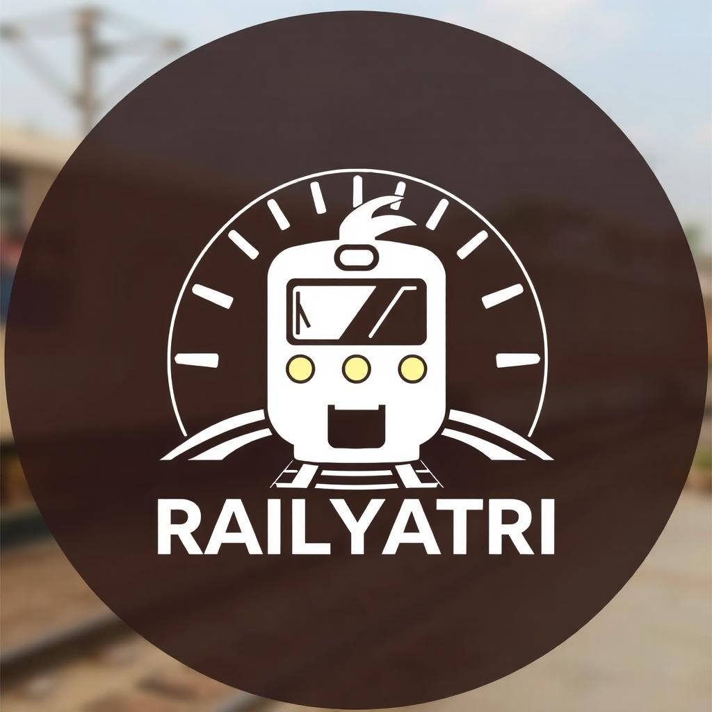
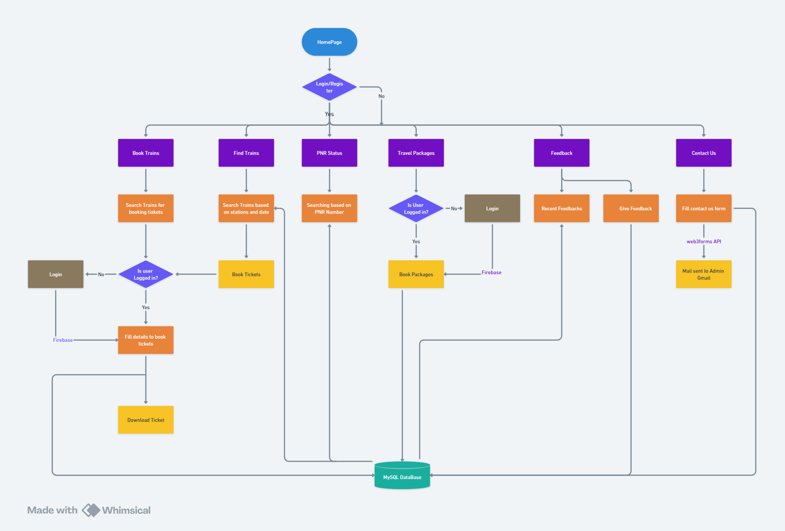

# RailYatri Project  



## Project Description
The RailYatri project aims to provide a seamless experience for railway travelers in India. This platform integrates features such as ticket booking, train search, PNR status checking, and curated tourism packages, all while maintaining a user-friendly interface. It leverages technology to make train journeys smoother and more accessible.

## Features
- **Ticket Booking**: Easily book train tickets directly through the platform.
- **Authentication System**: Authentication system implemented using Firebase for secure login and registration.
- **Search Trains**: Find trains between given stations for any date.
- **PNR Status Check**: Check your ticket's PNR status and updates in real-time.
- **Tourism Packages**: Explore curated travel packages designed for tourists, including accommodation options.
- **Feedback System**: An easy way for users to share feedback, helping to improve their experience.
- **Contact Us**: Connect with us for support, inquiries, or assistance anytime.

## Technologies Used
### Frontend
- **HTML**: Markup language for structuring the website content.
- **CSS**: Stylesheet language for designing the layout and look of the website.
- **JavaScript**: Programming language for adding interactivity and dynamic features to the website.

### Backend
- **JavaScript**: Programming language for adding authentication and implementing different logic-based parts.
- **PHP**: Server-side scripting language used for handling logic, data processing, and communication with the database.
- **Firebase**: Used for implementing the authentication system using Google and email/password.

### Database
- **MySQL**: Relational database management system for storing user data, train information, and other related records.

### API
- **Web3Forms**: API used for creating and handling web forms for user submissions (for user contact us form submission).

### Hosting
- **InfinityFree**: Free hosting platform used to host the website and handle server-side requests.

### Version Control
- **Git**: Version control system used for tracking changes in the codebase.
- **GitHub**: Repository hosting service for version control and collaboration.

## Getting Started

This project is already hosted on InfinityFree, follow these steps to access it:
- Open a browser and go to the URL where your site is hosted(http://railyatri.infinityfreeapp.com).
- All the necessary setup should already be done on the server side. The website will be live and accessible via this link.


### Prerequisites
- **PHP** (version 7.4 or above)
- **MySQL** (through phpMyAdmin)
- **Apache or Nginx** (for local server setup)
- **Code Editor** (VSCode, Sublime Text, etc.)
- **XAMPP or MAMP** (optional for easy local setup)

### Installation
### 1. Clone the Repository
   ```bash
   git clone https://github.com/arpitkumar0007/CSP_Project_RailwayTicketBooking.git
   cd CSP_Project_RailwayTicketBooking
   ```

### 2. Set Up Apache and MySQL
If you're using XAMPP or MAMP, follow these steps:
- Install XAMPP (which includes Apache, MySQL, and PHP).
- Start Apache and MySQL servers from the XAMPP/MAMP control panel.\
If not using XAMPP or MAMP, manually install Apache and MySQL and configure them to run on your local machine.

### 3. Configure Database
- Open phpMyAdmin (usually available at http://localhost/phpmyadmin/), and create a new database for the project (railway_db).
- Import the SQL file provided in the repo to create tables and populate the database.
- Database file: [railway_db](railway_db.sql)
- Run this command to populate the database
  
   ```bash
   mysql -u root -p railway_db < railway_db.sql
   ```

### 4. Run the Application
- Place your project files in the htdocs (XAMPP) or www (MAMP) directory.
- If using Apache, open your browser and navigate to http://localhost/CSP_Project_RailwayTicketBooking to see the app in action.


## Features Supported/working outline

### 1. User Authentication
- Login/Register:
- Users should log in or register to access most features, ensuring secure and personalized services. Firebase is integrated for authentication.
### 2. Core Features
 **Book Trains:**
- Search for trains by entering source, destination, and date.
- Users must log in to proceed with ticket booking.
- Fill in passenger details, finalize booking, and download tickets.
**Find Trains:**
- Search for train availability based on stations and dates without logging in.
- Direct link to booking if a train is found.
**PNR Status:**
- Check the status of a booked ticket by entering the PNR number.
**Travel Packages:**
- Explore and book travel packages curated for convenience.
- Requires login for booking packages.
### 3. Support and Feedback
**Feedback:**
- View recent feedback from other users.
- Submit feedback to improve services.
**Contact Us:**
- Fill a contact form for inquiries or assistance.
- Uses web3forms API to send queries directly to admin's Gmail.
### 4. Database and Integration
**Database:**
- A central MySQL Database stores user, train, booking, and feedback data securely.
**Firebase:**
- Used for user authentication and managing user-related data.
**Web3forms API:**
- Handles contact form submissions effectively.
### 5. Ticket Management
- Users can download their tickets after booking.
- Real-time updates on booking status are integrated.
### 6. User Flow
- Users can navigate through Home Page > Login/Register > Select Features like Booking, Checking PNR, or Contact Us.
- Seamless redirection ensures smooth user experience across sections.

## Workflow of the Website



  
